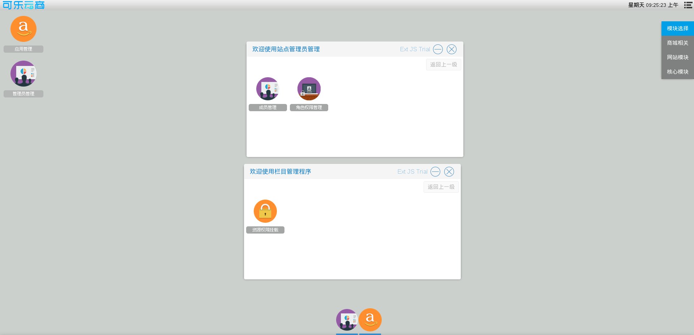

# 核心模块相关操作

商城超级管理员拥有　管理桌面程序，添加管理员，创建角色，并为角色赋予对应的功能等功能

应用管理入口　进入系统后台后在桌面右上方模块选择栏选择核心模块，可以看到桌面上有一个应用管理图标，点击进入与桌面程序相关的操作

管理员管理入口　进入系统后台后在桌面右上方模块选择栏选择核心模块，可以看到桌面上有一个管理员管理图标，点击进入与管理员，角色等相关的操作
如图7

在弹出的窗口中

选择权限资源挂载进入桌面程序挂载，卸载的相关操作

选择成员管理进入管理员相关操作

选择角色权限管理进入角色及权限相关操作
