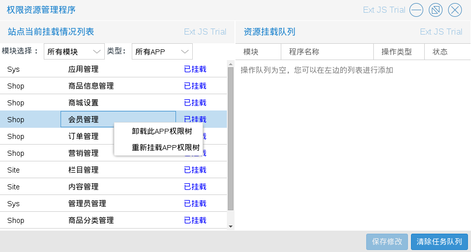
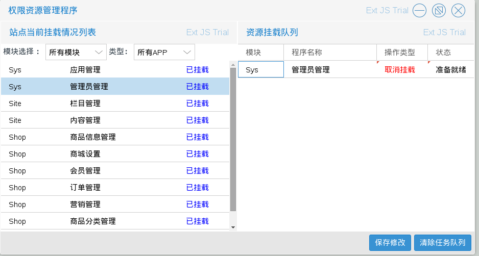
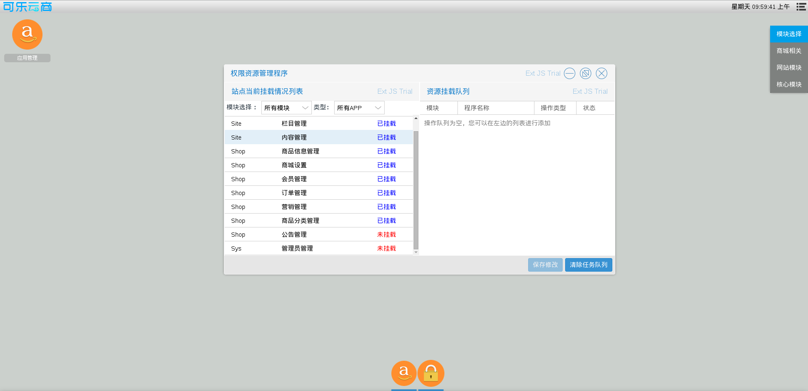
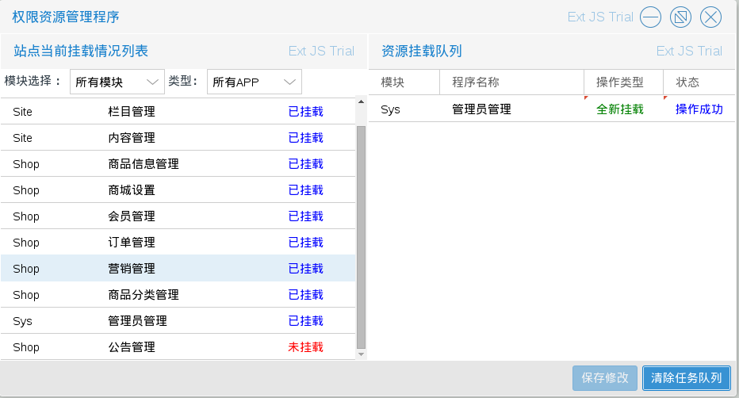
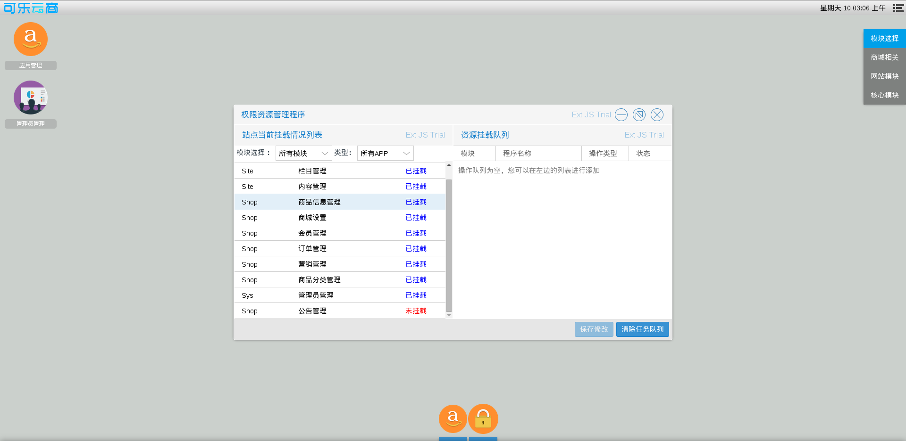

# 应用管理

商城管理员进入权限资源管理程序后，可以对桌面程序进行管理（不建议修改）

如图7.1.1

如图所示可以根据模块，类型搜索资源

* 卸载此APP权限树
入口为：图7.1.1中在左侧单击右键后出现的选择列表中的
   ＂卸载此APP权限树＂
APP卸载之后将不会在桌面展示出来，如图7.1.2

单击右侧底部的保存修改会将执行资源挂载队列中的所有app操作
包括取消挂载和挂载，不论是挂载程序或取消挂载程序（卸载）
都需要重新加载页面（刷新）才能生效．
如图7.1.3

* 重新挂载此APP权限树
与卸载类似，如图7.1.4－7.1.5

