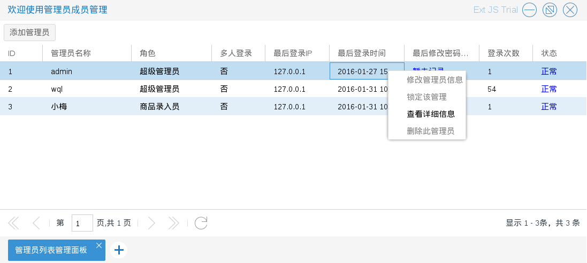
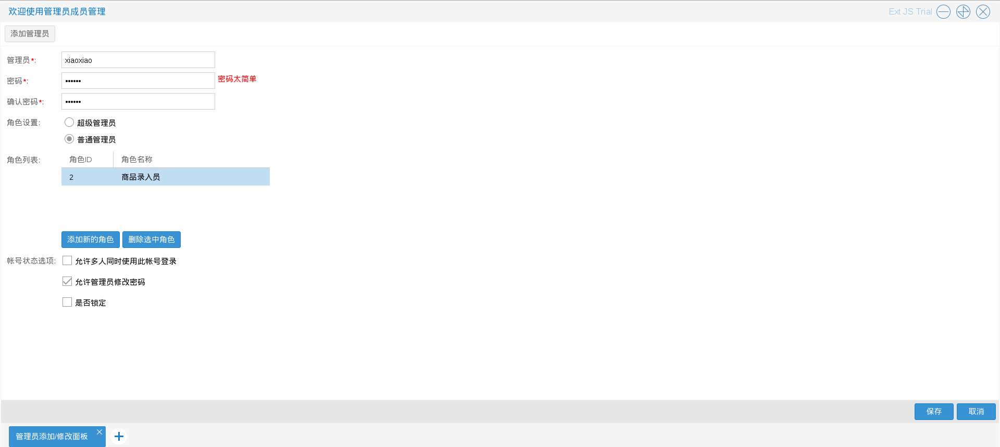

# 管理员管理

商城管理员进入管理员成员管理程序后，可以对管理员进行管理；
其中管理员分为两类：超级管理员（可以操作一切，但是超级管理
员之间不能互相操作，超级管理员可以添加超级管理员，可以修改部分信息或删除普通管理员，注：添加之后不可修改或删除超级管理员，需慎重），普通管理员（需要赋予对应的角色，根据角色赋予对应的权利，不建议普通管理员操作核心模板）

如图7.2.1

* 添加管理员　入口为图7.2.1中列表顶部的添加管理员按钮
如图7.2.2－7.2.4

如上图所示普通管理员需要选择角色

* 修改管理员信息　入口为图7.2.1单击右键后出现的选择列表中的 　修改管理员信息　如图7.2.5

如图　管理员的帐号不可修改，可以修改密码，角色等

* 锁定管理员　入口：一，为图7.2.1单击右键后出现的选择列表中的 　锁定此管理员；二，为修改管理员信息下面的帐号状态选项　如图7.2.6

* 删除管理员　入口为图7.2.1单击右键后出现的选择列表中的 删除此管理员 结果如图7.2.7

* 查看管理员　入口为图7.2.1单击右键后出现的选择列表中的 删除此管理员　如图7.2.8

商城管理员进入管理员角色权限管理程序（拥有管理员角色权限管理）后，可以对管理员的角色进行管理．

如图7.2.9

如图所示：其中角色相关下有添加新角色和角色列表两个操作；
授权相关下有角色授权赋予和角色成员管理两个操作

* 添加新角色 管理员可以添加新角色　入口：角色相关下的添加新角色选项
如图7.2.10－7.2.11

结果

* 修改角色信息 管理员可以修改角色信息　入口：列表中单击右键后出现的选择列表中的 　修改角色信息
如图7.2.12－7.2.13

结果

* 角色权限赋予　为角色指定可使用程序
如图7.2.14－7.2.16

单击右侧需要赋权的角色，出现程序的选择树，如图

可以重新选择该角色下所有管理员可以使用的程序，如图

点击底部的保存授权数据按钮后生效，点击还原选择按钮将重置为角色原有的权限

* 角色成员管理　为角色指定管理员　入口：一，为图7.2.9列表中单击右键后出现的选择列表中的 　成员管理；二，为授权相关下的角色成员管理选项

其中第二种方法需要选择角色如图7.2.17

角色成员管理　如图7.2.18

如上图所示：其中不属于该角色的管理员和属于该角色的管理员
可以随意拖动，即每个管理员可以拥有多个角色；点击底部的保存按钮后修改生效，角色对应的管理员将拥有该角色对应的权限；点击底部的还原按钮将回到拖动之前的状态

* 删除角色　入口：一，为图7.2.9列表中单击右键后出现的选择列表中的 　删除角色

如图7.2.18

