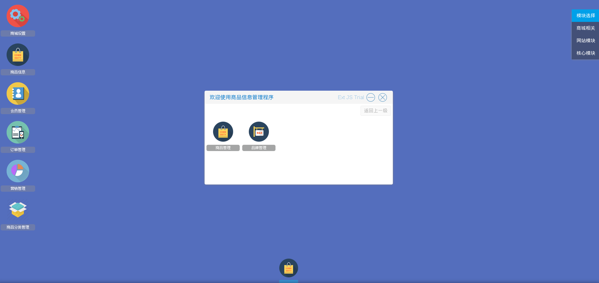

# 商品相关操作

商城管理员在添加商品之前，需要先添加商品分类和商品品牌

商品和品牌操作入口　进入系统后台后在桌面右上方模块选择栏选择商城相关，可以看到桌面上有一个商品信息图标，点击进入商品和品牌相关的操作

如图3

在弹出的窗口中

选择商品管理进入商城商品的添加，修改

选择品牌管理进入商城品牌的相关操作

商品分类操作入口　进入系统后台后在桌面右上方模块选择栏选择商城相关，可以看到桌面上有一个商品分类管理图标，点击进入商品分类相关的操作　如图3
