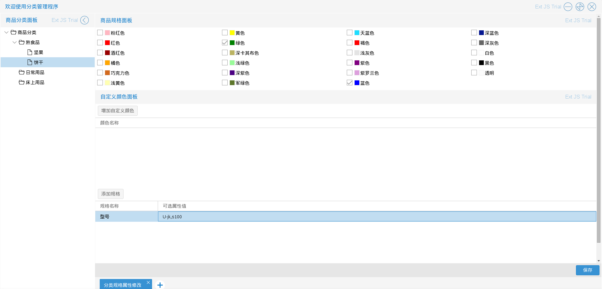

# 分类管理

商城管理员进入商品分类管理程序后，可以自定义商品分类，包括添加和修改分类
（建议最多建立三层分类）
如图3.1.1－3.1.2

如上图所示分类分为普通分类和详细分类两种：其中普通分类拥有添加普通分类，添加详细分类，修改分
类信息等三个操作；详细分类拥有修改分类信息，修改分类规格属性，修改分类查询属性等三个操作，每次操作将在保存后生效

* 添加普通分类
管理员添加普通分类比较简单（分类图标，在手机版上会展示出来）入口为图3.1.1中在左侧列表普通分类
或商品分类单击右键后出现的选择列表中的＂添加普通分类＂选项
如图3.1.3

结果如图3.1.4

* 添加详细分类
入口为图3.1.1中在左侧列表普通分类或商品分类单击右键后出现的选择列表中的＂添加详细分类＂选项，
如图3.1.5

管理员可以根据实际需求，添加特殊的属性组，完善基本参数　如图3.1.6－3.1.7

如上图所示，管理员可以通过属性组面板下的添加属性组，增加一个新的属性组，并且新增加的属性组可以继续增加其拥有的属性，也可以修改属性组的名称，删除属性组（除了基本参数之外的属性组）
如图3.1.8

添加详细分类完成的结果如图3.1.9

* 修改分类信息　入口为图3.1.1与3.1.2中在左侧列表普通分类或详细分类单击右键后出现的选择列表中的＂修改分类信息＂选项根据分类的类型，修改分类信息分为：

一，修改普通分类信息，相对简单，如图3.1.10－3.1.11

二，修改详细分类信息，与添加详细分类类似，如图3.1.12－3.1.13

注：不管是添加还是修改详细分类，对于已经添加的属性都只能做删除操作（在属性上单击右键弹出＂删除选中属性＂菜单），如果添加出错了请删除该条属性后重新添加，如果添加的属性名称相同，将保留原有属性．

* 修改分类规格属性　管理员可以自定义商品的规格属性，包括但不限于颜色，型号等
入口为图3.1.2中在左侧列表详细分类单击右键后出现的选择列表中的＂修改分类规格属性＂选项
如图　3.1.14－3.1.15

* 修改分类查询属性　管理员可以添加商品分类的查询属性，（这个用于全站商品的搜索筛选）
入口为图3.1.2中在左侧列表详细分类单击右键后出现的选择列表中的＂修改分类查询属性＂选项
如图　3.1.16

如上图在右侧列表的上方有一个添加查询属性的按钮，完成弹出窗口的内容并保存后成功添加一条该分类下的查询属性（注：完成弹出窗口后，需要在查询属性列表页再保存一次，才会生效，保存成功后，网站会即时列出查询条件，但是不会出现筛选结果，需要在商品管理程序中生成索引数据后才会有筛选结果）
如图3.1.17－3.1.18

对已经添加的分类查询属性可以做删除操作（在属性上单击右键弹出＂删除选中属性＂菜单），如果添加相同的查询属性名称，会覆盖掉原有的（以新加的为重）

