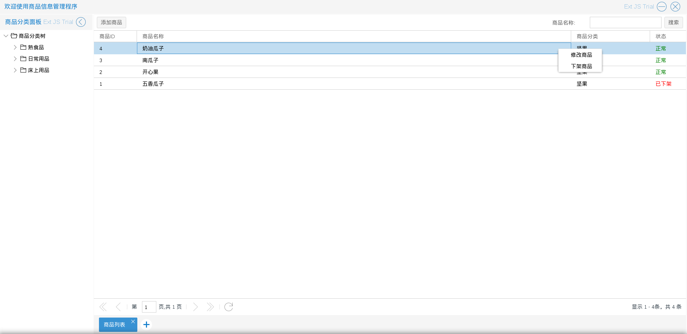

# 商品管理
商城管理员进入商品管理程序后，可以对发布商品，修改商品，上下架商品

商品根据是否上架分为：正常，已下架两种状态

如图3.2.1

* 添加商品　入口为图3.2.1中列表顶部的添加商品按钮
如图3.2.2－3.2.4

由上图所示添加商品时可以添加新的属性分组（入口　商品属性下的添加属性分组按钮），根据分类的规格选择商品拥有的规格并为每一个规格组合添加市场价，商城价，库存量，规格图片，最后可以为商品添加一些详细的描述图片
如图3.2.5

图中新添加的属性组可以被删除，属性组下可以继续添加新属性(入口　属性组下的添加属性按钮)也可以删除属性(入口　属性组下的删除此项属性按钮)

* 修改商品 入口为图3.2.1中单击右键后出现的选择列表中的 修改商品
如图3.2.6－3.2.7　（与添加商品类似）

不同的是商品属性下没有添加属性组按钮了，也就是说修改商品不可能修改属性组，只可以修改每个
属性的值或规格组合
如图3.2.8－3.2.9

* 上下架商品　入口有两处：

其一，为图3.2.1中单击右键后出现的选择列表中的 下架商品（正常）或上架商品（已下架）
如图3.2.10

其二，为修改商品中的商品状态选项

* 生成分类搜索属性数据
需要先在分类管理程序中完成分类查询属性，生成后可以通过查询条件查到对应商品

入口为图3.2.11中在左侧列表单击右键后出现的选择列表中的 生成该分类搜索属性数据

