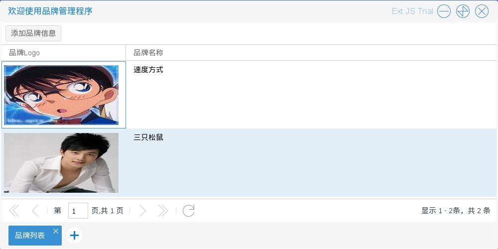

# 品牌管理

商城管理员进入品牌管理程序后，可以对品牌信息进行必要的添加，修改，删除

如图3.2.1

* 添加品牌　入口为图3.2.1中列表顶部的添加品牌信息按钮
如图3.2.2－3.2.3

* 修改品牌 入口为图3.2.1中单击右键后出现的选择列表中的 修改选中品牌
如图3.2.4－3.2.5

* 删除品牌　入口为图3.2.1中单击右键后出现的选择列表中的 删除选中品牌
如图3.2.6

