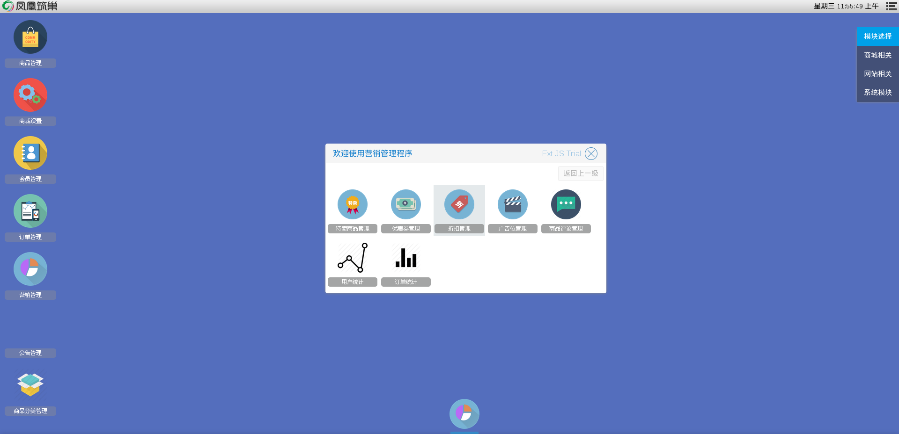

# 营销相关操作

商城管理员可以对设置一些优惠活动，包括限时特卖，发放优惠券，设置广告位
等等
营销操作入口　进入系统后台后在桌面右上方模块选择栏选择商城相关，可以看到桌面上有一个营销管理图标，点击进入与营销相关的操作

如图5

在弹出的窗口中

选择特卖商品管理进入设置特卖的相关操作

选择优惠券管理进入与优惠券相关的操作

选择折扣管理进入设置折扣信息的相关操作

选择广告位管理进入设置广告位的相关操作

选择商品评论管理进入与评论相关的操作

选择用户统计进入查看用户注册的情况

选择订单统计进入查看商品订单的情况
