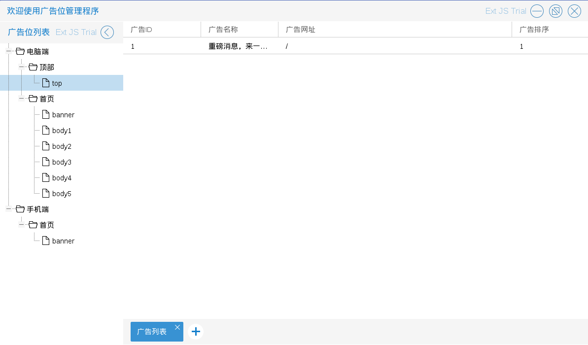

# 广告位管理

商城管理员进入广告管理程序后，可以对广告进行一些操作

管理员只能为特定的广告位添加，修改，删除广告

如图5.4.1

* 添加广告　入口为图5.4.1中在左侧列表没有子节点处，单击右键后出现的选择列表中的　为该广告位添加广告

如图5.4.2－5.4.4

* 修改广告　入口为图5.4.5中在右侧列表，单击右键后出现的选择列表中的　修改广告

如图5.4.5－5.4.7

* 删除广告　入口为图5.4.5中在右侧列表，单击右键后出现的选择列表中的　删除广告

如图5.4.8

