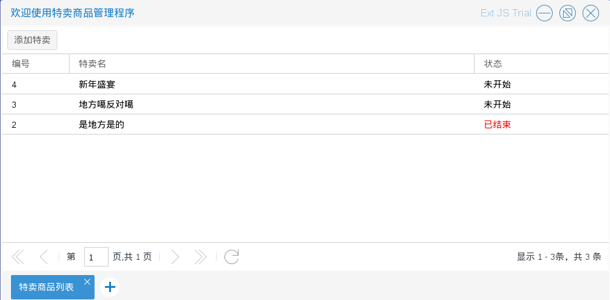

# 特卖管理

商城管理员进入特卖商品管理程序后，可以对特卖信息进行一些操作

特卖信息根据特卖的开始时间和结束时间可以分为3种状态：未开始，特卖中，已结束

系统会保证同件商品在同一时间段只有一条特卖信息

如图5.1.1

* 查看特卖　商城管理员可以查看特卖，浏览该项特卖的相关信息，所含商品　入口为图5.1.1中单击右键后出现的选择列表中的查看特卖
如图5.1.2

* 添加特卖　商城管理员可以添加特卖，添加特卖除了要录入特卖基本信息外还需要选择商品，
且至少需要选一件商品，选择商品后要为每一个选择的商品添加详细的特卖信息
入口为图5.1.1中的添加特卖按钮
如图5.1.3－5.1.5

* 修改特卖　商城管理员可以修改特卖（前提是该特卖未开始），入口为图5.1.1中单击右键后出现的选择列表中的修改特卖
如图5.1.6－5.1.7

* 删除特卖　特卖活动结束后　商城管理员可以删除特卖（前提是该特卖已结束），入口为图5.1.8中单击右键后出现的选择列表中的
删除特卖 如图5.1.8－5.1.9

