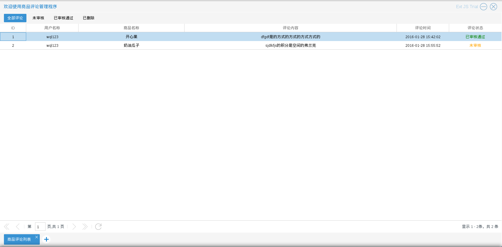
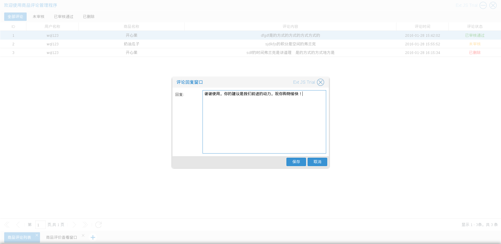
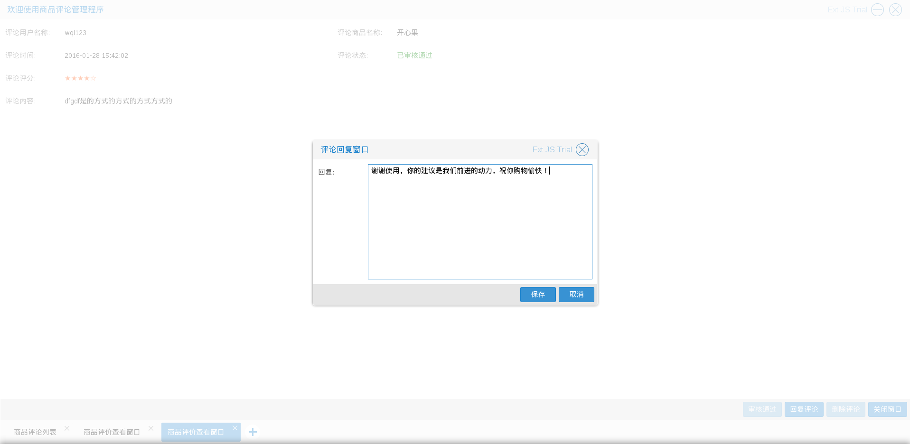
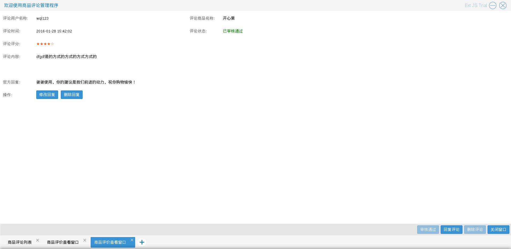
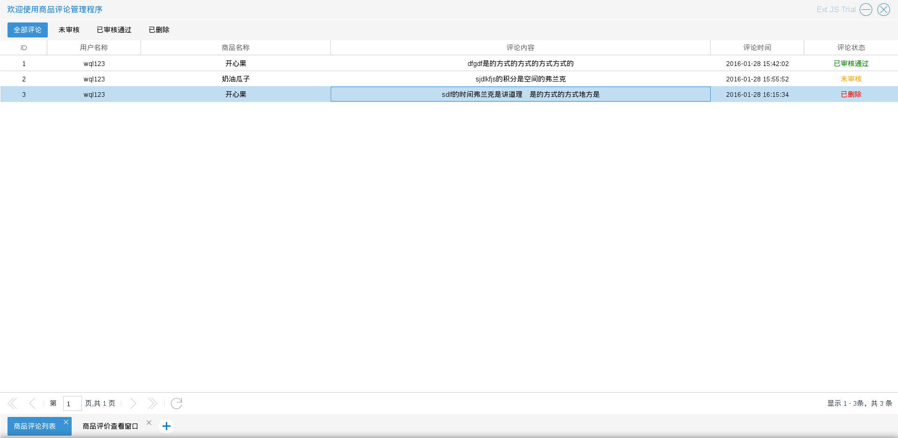
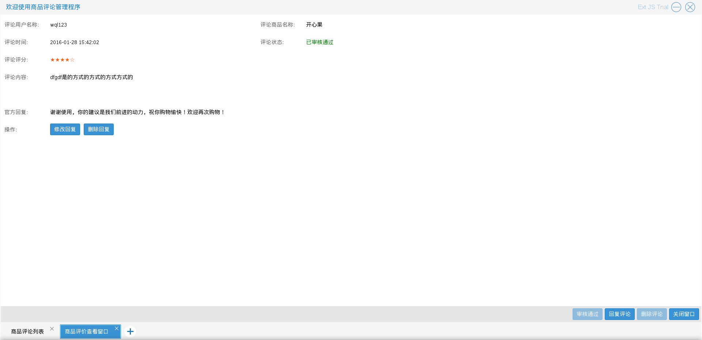

# 商品评论管理

商城管理员进入商品评论管理程序后，可以对评论进行一些操作

商品评论有3种状态：未开始，可领取，已过期
如图5.5.1

* 审核评论　　商城管理员负责审核用户评论，审核通过的评论可以被网站访问者浏览　入口有两处：
其一　如图5.5.1中单击右键后出现的选择列表中的　审核评论
其二　为查看评论底部的＂审核评论＂按钮
结果如图　5.5.2

* 查看评论　　商城管理员可以查看评论的详细内容　入口如图5.5.1中单击右键后出现的选择列表中的　查看评论
结果如图　5.5.3

* 回复评论　　商城管理员可以与审核通过的评论进行互动　入口有两处：
其一　如图5.5.1中单击右键后出现的选择列表中的　回复评论
其二　为查看评论底部的＂回复评论＂按钮
如图　5.5.4－5.5.6

* 删除评论　　商城管理员可以删除未审核通过的评论　入口如图5.5.1中单击右键后出现的选择列表中的　删除评论
结果如图　5.5.7

* 修改回复　　商城管理员可以修改回复内容　入口为查看评论中的的＂修改回复＂按钮
结果如图　5.5.8

* 删除回复　　商城管理员可以删除回复内容　入口为查看评论中的＂删除回复＂按钮
结果如图　5.5.9

