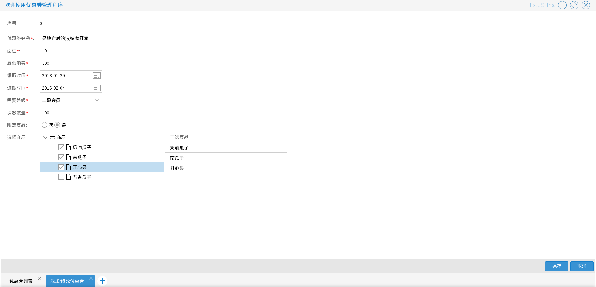

# 优惠券管理

商城管理员进入优惠券管理程序后，可以对优惠券进行一些操作

优惠券信息根据优惠券的领取时间和过期时间可以分为3种状态：未开始，可领取，已过期

如图5.2.1

* 查看优惠券　商城管理员可以查看优惠券，浏览该项优惠券的相关信息　入口为图5.2.1中单击右键后出现的选择列表中的查看优惠券
如图5.2.2

* 添加优惠券　商城管理员可以添加优惠券，添加优惠券除了要录入优惠券基本信息外还需要选择优惠券使
用范围，针对限定商品的优惠券需要选择适用的商品
入口为图5.2.1中的添加优惠券按钮
如图5.2.3－5.2.5

* 修改优惠券　商城管理员可以修改优惠券（前提是该优惠券未开始），入口为图5.2.1中单击右键后出现的选择列表中的修改优惠券
如图5.2.6－5.2.7

* 删除优惠券　优惠券活动结束后　商城管理员可以删除优惠券（前提是该优惠券已过期），入口为图5.2.8中单击右键后出现的选择列表中的
删除优惠券 如图5.2.8－5.2.9

