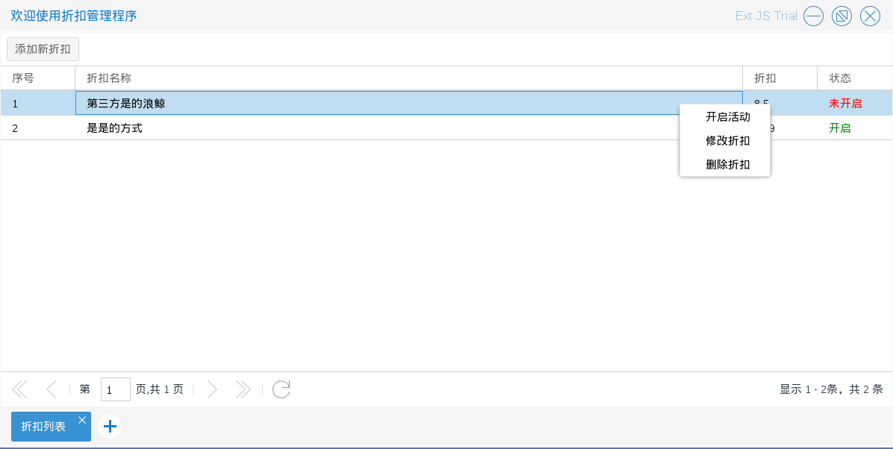
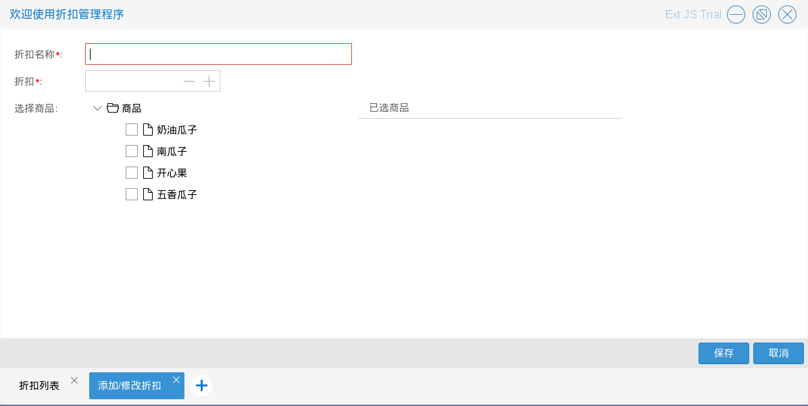
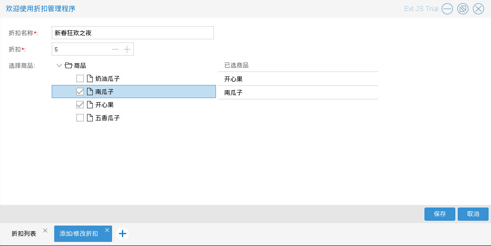
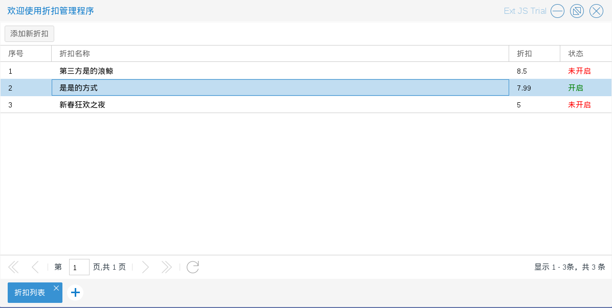
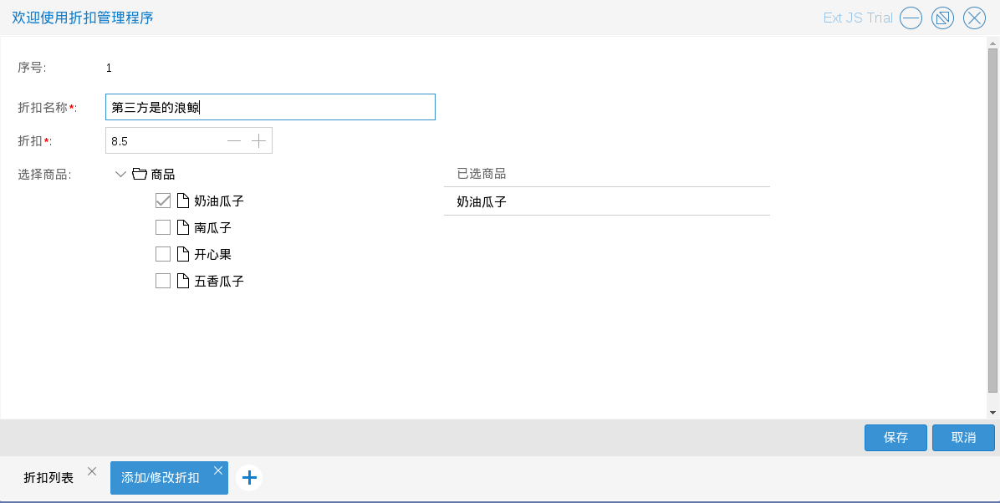
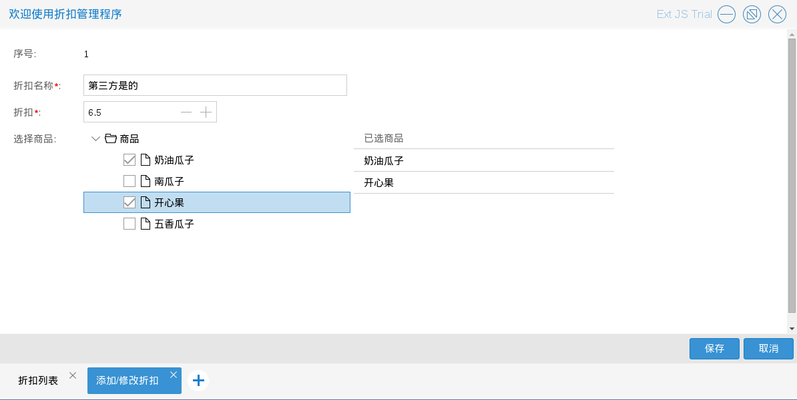
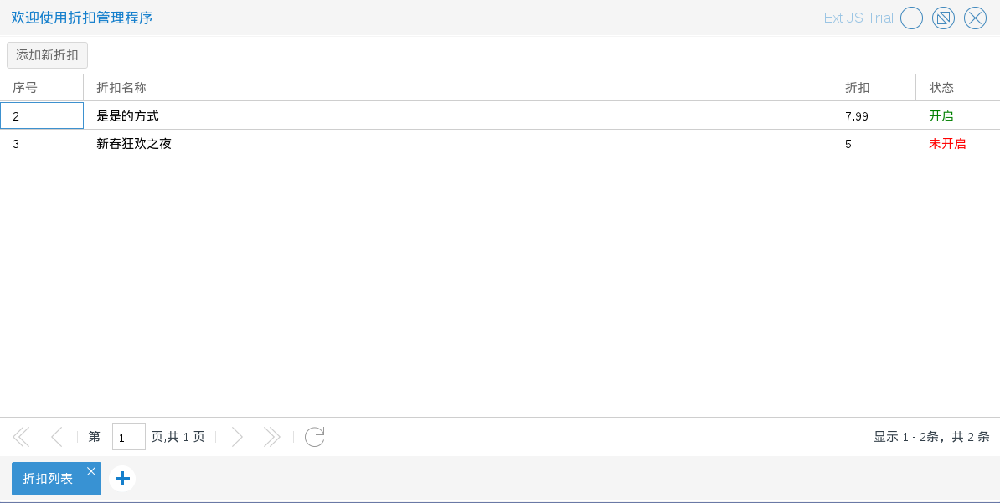
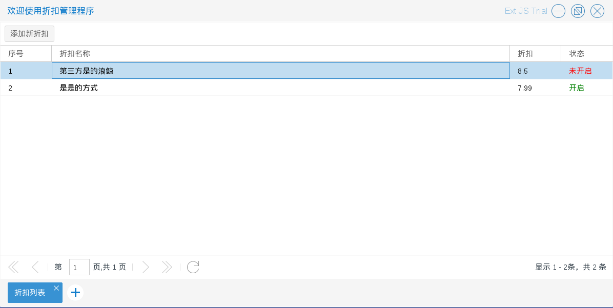

# 折扣管理

商城管理员进入折扣管理程序后，可以对折扣进行一些操作

折扣信息根据折扣是否开启可以分为两种状态：未开启，开启

如图5.3.1

* 开启活动　商城管理员可以开启折扣活动　入口为图5.3.1中单击右键后出现的选择列表中的开启活动
如图5.3.2

* 添加新折扣　商城管理员可以添加折扣，添加折扣除了要录入折扣基本信息外还需要选择参加该折扣的
商品，选择商品时，如果该件商品存在其他折扣中，会给出提示是否继续，如果继续的话，其他折扣中的
这件商品会被删除（也就是以当前折扣为重）
入口为图5.3.1中的添加新折扣按钮
如图5.3.3－5.3.5

* 修改折扣　商城管理员可以修改折扣（前提是该折扣不在开启状态），入口为图5.3.1中单击右键后出现的选择列表中的修改折扣
如图5.3.6－5.3.7

* 删除折扣　折扣活动结束后　商城管理员可以删除折扣（前提是该折扣不在开启状态），入口为图5.3.1中单击右键后出现的选择列表中的
删除折扣 如图5.3.8

* 结束活动　商城管理员可以结束折扣活动　入口为图5.3.9中单击右键后出现的选择列表中的开启活动
如图5.3.9－5.3.10

