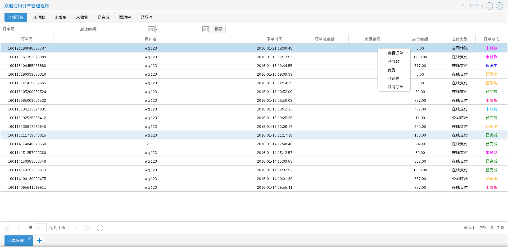

# 订单管理
商品订单拥有：未付款，未发货，未收货，已完成，取消中，已取消等6个有效状态　如图4.1.1

商品订单的状态变化为：

用户下单（未付款）->用户支付（未发货）->商家发货（未收货）->用户确认收货（已完成）　或

用户下单（未付款）->用户取消（取消中）->商家确认（已取消）

商城管理员进入订单管理程序后，可以对订单进行一些特定的操作

* 查看订单
商城管理员可以查看订单的详情，　入口为图4.1.1中单击右键后出现的选择列表中的查看订单
如图4.1.2

后续还会提供订单打印功能　入口为上图的打印订单按钮

* 发货
商城管理员可以在发货后执行发货操作，　入口为图4.1.1中单击右键后出现的选择列表中的发货
如图4.1.3

如上图所示 管理员在进行发货操作时需要选择快递公司，填写快递单号．
发货操作完成后，订单状态将变成未收货　如图4.1.4

* 已完成　完成交易分为两种情况，一种是来自用户确认收货，另一种是商家在发货之后，没有收到快递公司的回退邮件，也没有收到用户的反馈，可以通过后台将订单的状态改为已完成　入口为图4.1.1中单击右键后出现的选择列表中的已完成

* 取消订单
同样分为两种情况，一种是来自用户（未完成支付之前可以取消订单，订单状态变为取消中），另一种是
订单过期后自动取消或者管理员手动取消
    入口为图4.1.1中单击右键后出现的选择列表中的取消订单
