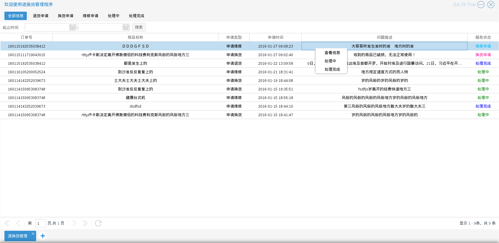
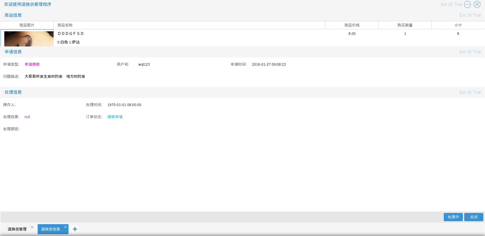
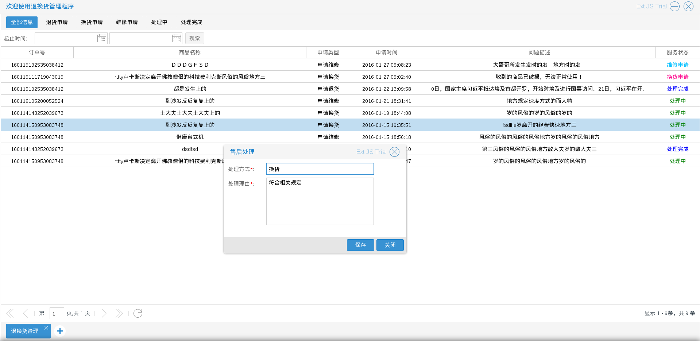
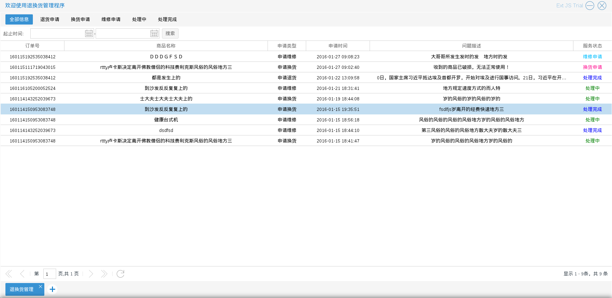

# 退换货管理
退换货订单拥有：退货申请，换货申请，维修申请，处理中，处理完成等5个有效状态　如图4.2.1

退换货订单的状态变化为：

用户完成交易后提出申请（退货申请，换货申请，维修申请）->商家确认处理（处理中）->商家处理完成
（处理完成）

商城管理员进入退换货管理程序后，可以对退换货订单进行一些特定的操作

* 查看信息
商城管理员可以查看退换货订单的详情，　入口为图4.2.1中单击右键后出现的选择列表中的查看信息
如图4.2.2

* 设为处理中
有两种方式，一：通过查看信息页中的处理中按钮，将退换货订单状态改为处理中；二：
在退换货订单列表　入口为图4.2.1中单击右键后出现的选择列表中的处理中

* 处理完成　商家处理完退换货申请后，可以将退换货订单的状态改为已完成　入口为图4.2.1中单击右键后出现的选择列表中的已完成
如图4.2.3

如上图所示，将退换货订单设为处理完成需要录入：处理方式和处理理由，结果如图4.2.4

