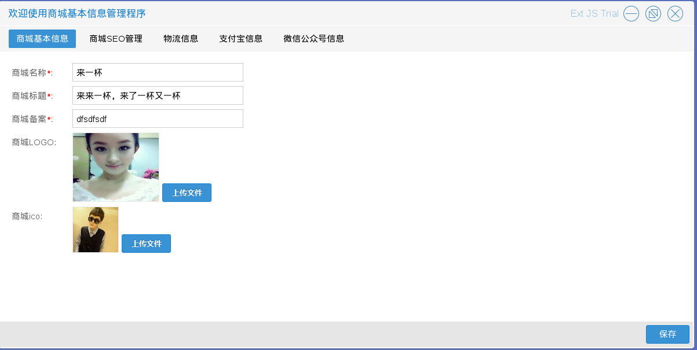
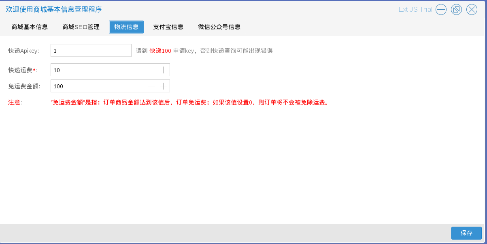

# 商城基本信息

商城管理员进入商城基本信息管理程序后，在对商城基本信息进行设置时，需要特别注意，因为这些信息都与商城运行和使用者的利益密切相关

商城基本信息包含五个部分：

* 商城基本信息　如图2.1.1
其中商城名称，LOGO在登录注册等相关页面有显著体现，商城ico就是浏览器选项卡最顶部显示的小图标

* 商城SEO管理　如图2.1.2

* 物流信息　如图2.1.3
商城管理员设置的快递apikey（来自快递100）在普通查询物流无法完成时调用，快递运费和免运费金额全站有效，生成订单时不满足免运费金额的订单会自动追加设置的快递运费

* 支付宝信息　如图2.1.4

* 微信公众号信息　如图2.1.5

