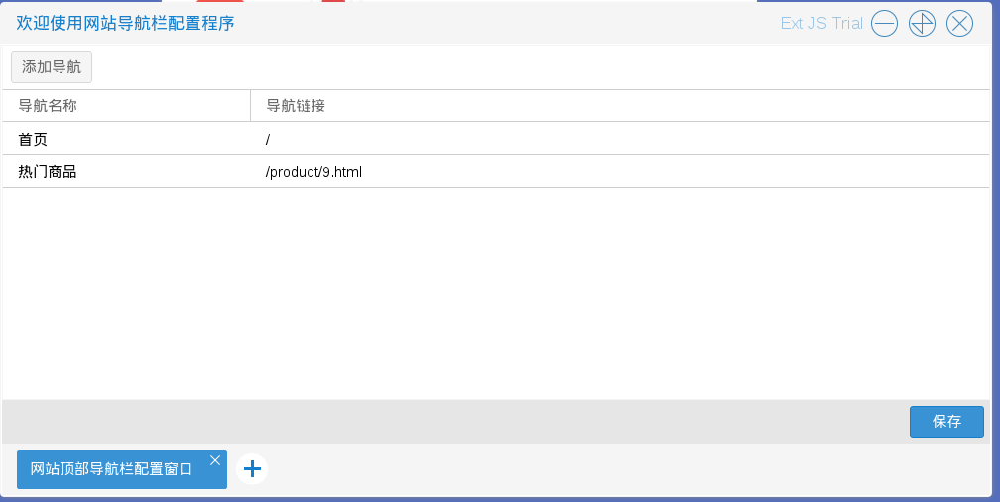

# 商城导航栏
商城管理员进入网站导航栏配置程序后，可以自定义导航栏（建议添加5-8个导航）

如图2.2.1

* 添加导航　入口　单击如图2.2.1中的添加导航按钮

    在添加导航页面可供选择的链接类型有五种，分别生成不同的链接

    例子1　用商品分类作为导航如图2.2.2－2.2.3

    例子2　用热卖商品作为导航如图2.2.4－2.2.5

* 修改导航　入口　如图2.2.1单击右键后出现的选择列表中的修改链接

    与添加导航页面类似可供选择的链接类型有五种，分别生成不同的链接

    例子3　用商品分类作为导航如图2.2.6－2.2.8

* 删除导航　入口　如图2.2.1单击右键后出现的选择列表中的删除链接
结果如图2.2.9

