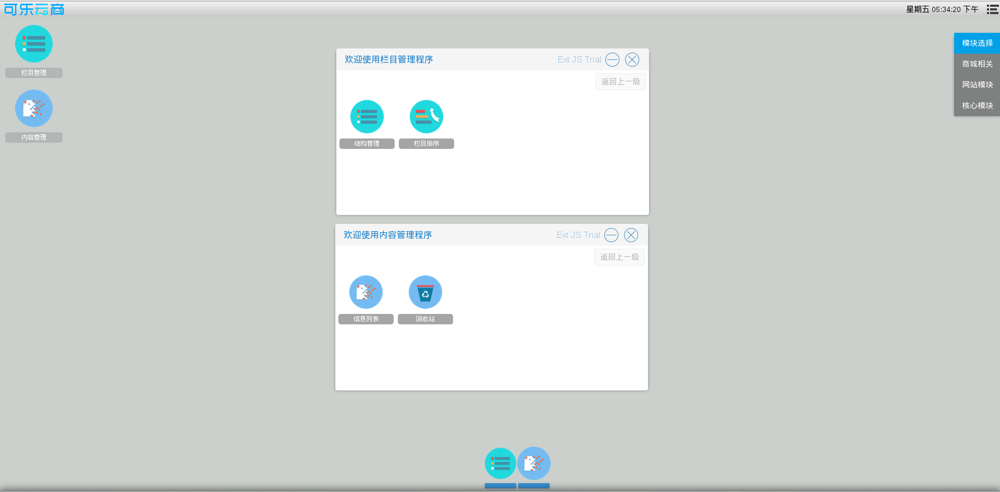

# 网站模块相关操作

商城管理员可以添加修改栏目信息，发表文章等

栏目管理入口　进入系统后台后在桌面右上方模块选择栏选择网站模块，可以看到桌面上有一个栏目管理图标，点击进入与栏目相关的操作

内容管理入口　进入系统后台后在桌面右上方模块选择栏选择网站模块，可以看到桌面上有一个内容管理图标，点击进入与文章等相关的操作
如图6

在弹出的窗口中

选择栏目结构管理进入栏目结构的相关操作

选择栏目排序进入栏目排序相关操作

选择信息管理进入文章等相关操作

选择信息回收站进入文章删除，还原相关操作
