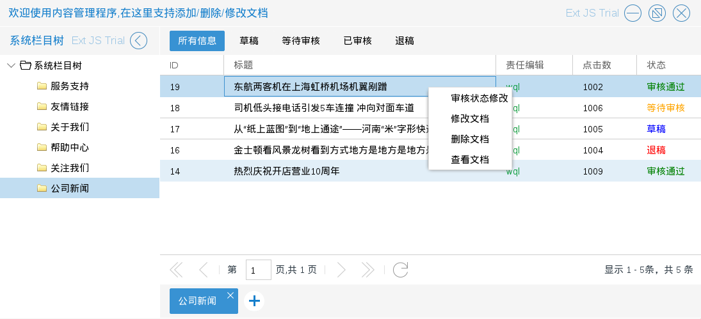
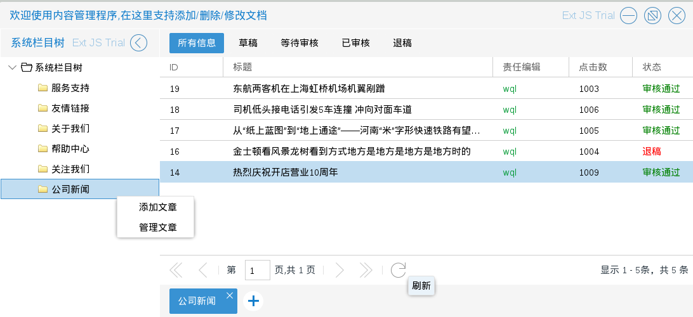
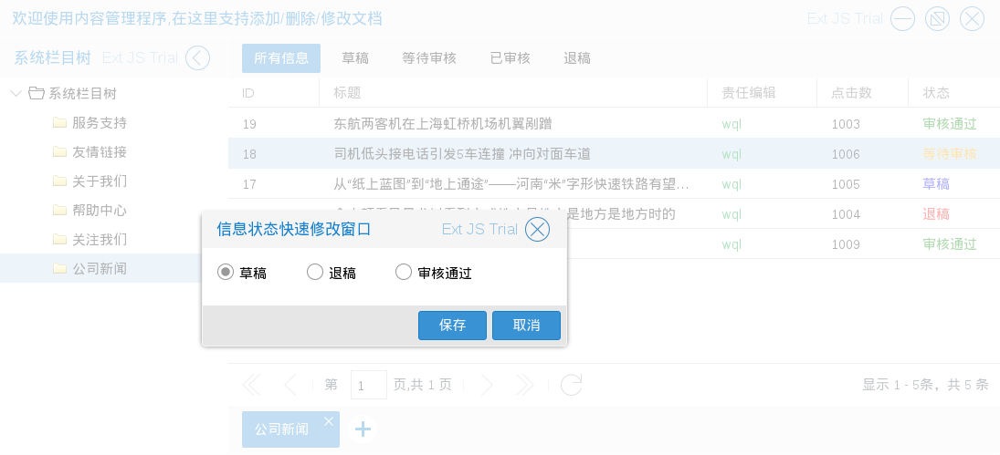
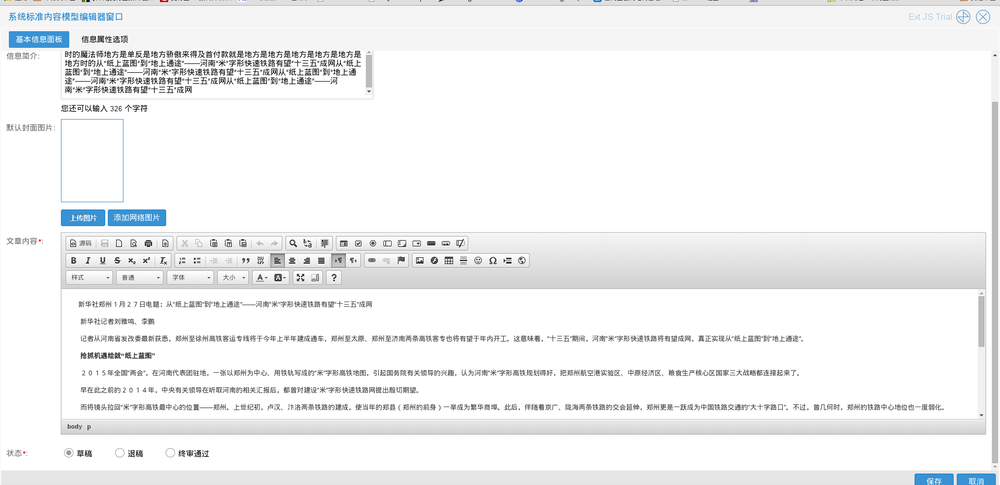
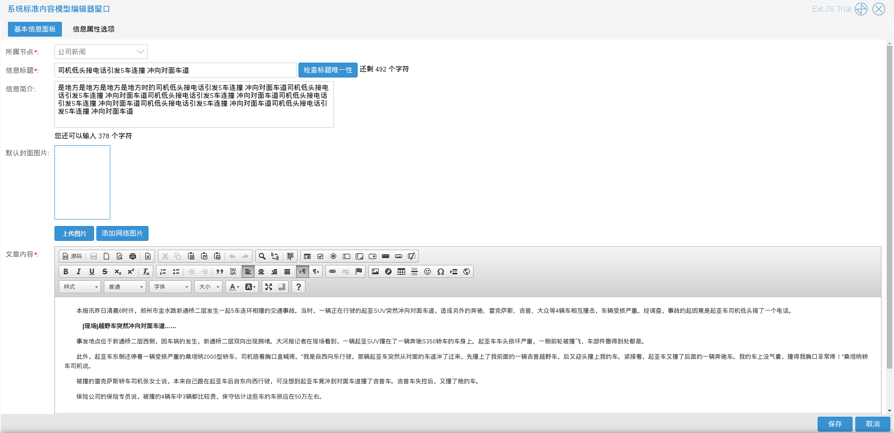
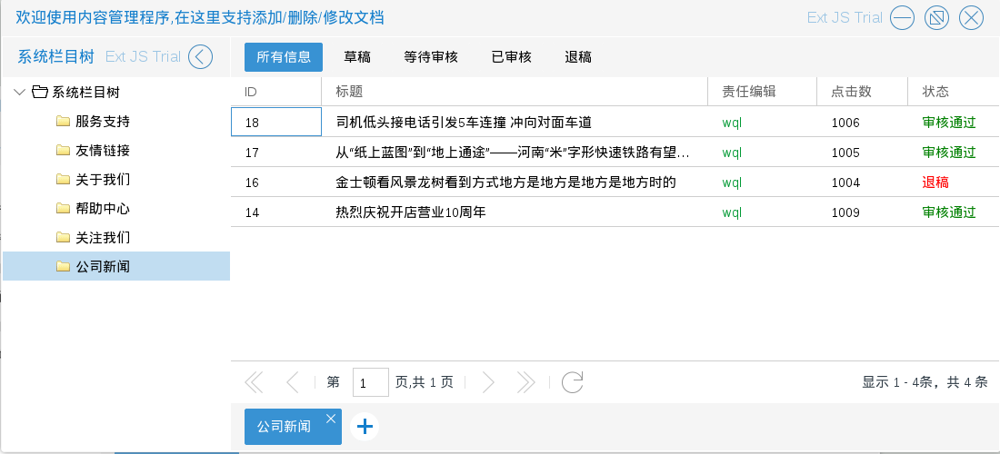
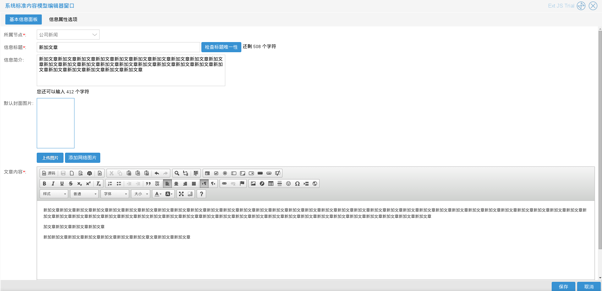
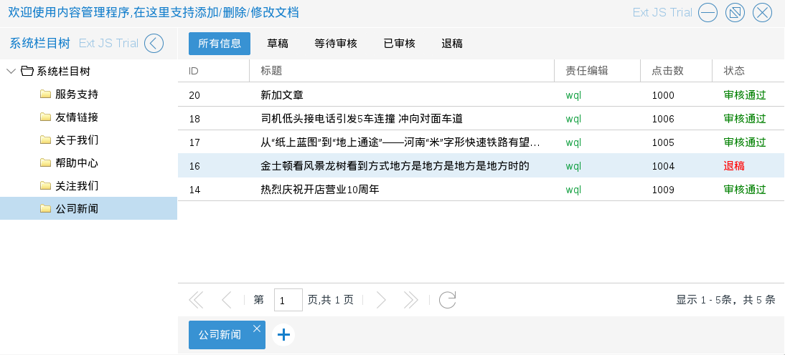
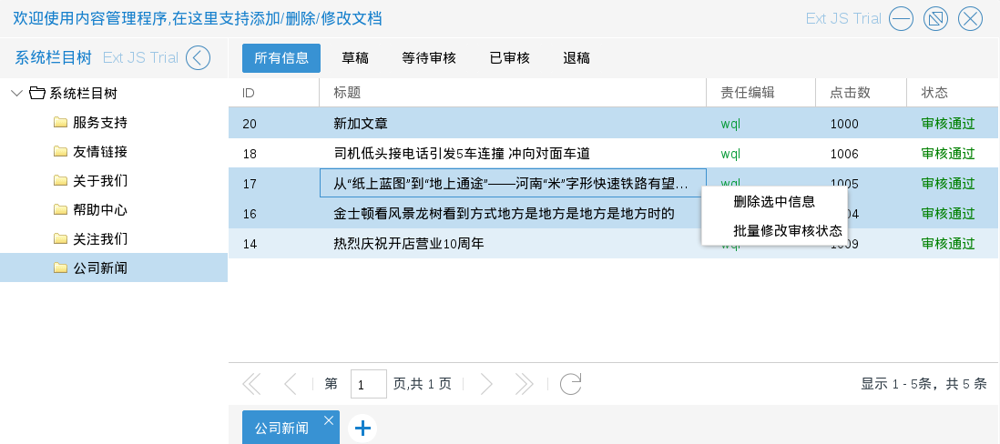
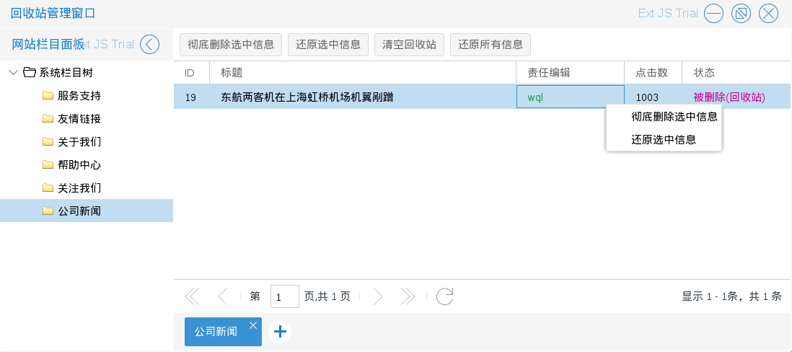

# 内容管理

商城管理员进入内容管理程序后，可以添加，修改，删除文章

如图6.2.1　左键单击左侧列表会列出该栏目下的所有文章
文章状态有四种：草稿，等待审核（回收站还原），已审核（即审核通过），退稿
只有审核通过的文章才可以被展示出来

如上图所示　审核通过的文章拥有四个操作：审核状态修改，修改文档，删除文档，查看文档
其他状态的文章拥有前三个操作．

文章列表还有一个入口　如图6.2.2在左侧列表单击右键后出现的选择列表中的　管理文章

* 审核状态修改　入口有两个：

一，为图6.2.1中在右侧列表单击右键后出现的选择列表中的　审核状态修改
如图6.2.3－6.2.4

二，修改文档底部的状态选择

* 修改文档　入口为图6.2.1中在右侧列表单击右键后出现的选择列表中的　修改文档
如图6.2.5

如上图所示
修改文档界面，有两栏　基本信息面板和信息属性选项
其中信息属性选项不建议修改
* 删除文档　入口为图6.2.1中在右侧列表单击右键后出现的选择列表中的　删除文档
结果如图6.2.6

* 添加文章　入口为图6.2.1中左侧列表单击右键后出现的选择列表中的　添加文章
与修改文章类似，如图6.2.7

结果如图6.2.8

注：审核状态修改和删除文档支持批量操作（按住ctrl再选择文章）如图6.2.9

商城管理员进入回收站管理程序后，可以彻底删除或还原文章（还原的文章处于等待审核状态，需要在内容
管理程序中进行审核操作，才能正常展示）

如图6.2.10　左键单击左侧列表会列出该栏目下的所有删除的文章

* 彻底删除和还原　支持批量操作（按住ctrl再选择文章）

彻底删除信息－入口有两个：一，列表顶部的彻底删除选中信息按钮；二，在右侧列表单击右键后出现的选择列表中的　彻底删除选中信息

还原信息－入口有两个：一，列表顶部的还原选中信息按钮；二，在右侧列表单击右键后出现的选择列表中的　还原选中信息
* 全局操作

清空回收站－彻底删除已删除文章，入口：列表顶部的清空回收站按钮

还原所有信息－还原所有已删除文章，入口：列表顶部的还原所有信息按钮
