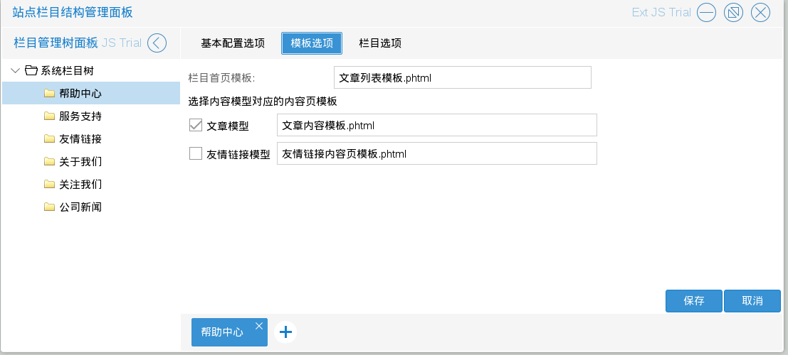
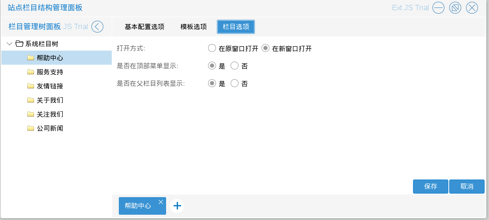
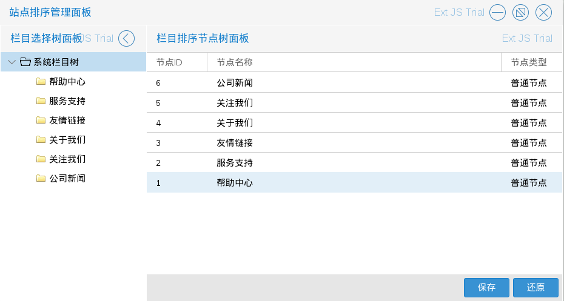

# 栏目管理

商城管理员进入站点栏目结构管理程序后，可以添加修改栏目

如图6.1.1

如图所示，系统默认的栏目有，帮助中心，服务支持，友情链接，关于我们，关注我们．商城管理员可以根据自己的需要增加不同的栏目再在商城导航栏中配置，比如增加一个公司新闻（文章类）

* 修改栏目
商城管理员可以修改栏目信息（不建议修改默认栏目），入口为：一，图6.1.1中在左侧单击右键后出现的选择列表中的修改栏目；二，左键单击左侧栏目
如图6.1.2

如上图所示栏目信息包括：基本配置选项，模板选项，栏目选项(其中栏目标识符唯一且不可修改)
如图6.1.3－6.1.4

* 添加普通栏目
商城管理员可以添加新栏目　入口为：图6.1.1中在左侧单击右键后出现的选择列表中的添加普通栏目
建议添加到系统栏目下如图　如图6.1.5

商城管理员进入站点排序管理程序后，可以排序栏目

* 栏目排序

管理员可以对栏目进行排序（目前没有什么用）如图6.1.6

如上图所示　在右侧列表拖动栏目进行排序，保存后生效，也可以还原至初始状态
