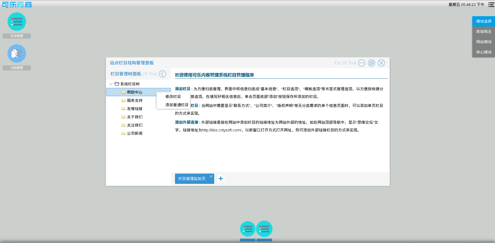
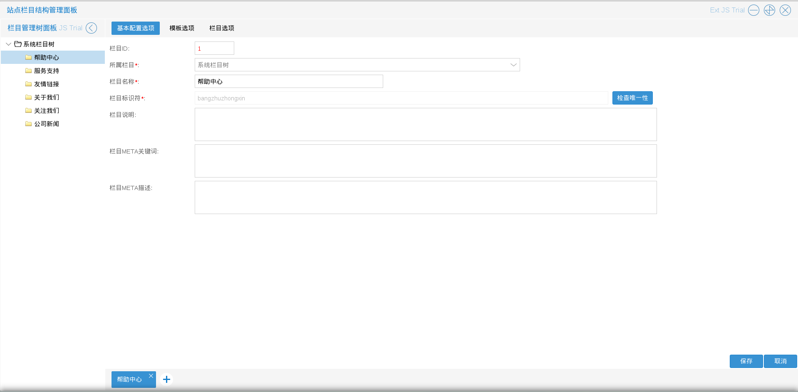

# 栏目管理

商城管理员进入站点栏目结构管理程序后，可以添加修改栏目

如图6.1.1

如图所示，系统默认的栏目有，帮助中心，服务支持，友情链接，关于我们，关注我们．商城管理员可以根据自己的需要增加不同的栏目再在商城导航栏中配置，比如增加一个公司新闻（文章类）

* 修改栏目
商城管理员可以修改栏目信息（不建议修改默认栏目），入口为：一，图6.1.1中在左侧单击右键后出现的选择列表中的修改栏目；二，左键单击左侧栏目
如图6.1.2

如上图所示栏目信息包括：基本配置选项，模板选项，栏目选项

* 添加普通栏目
