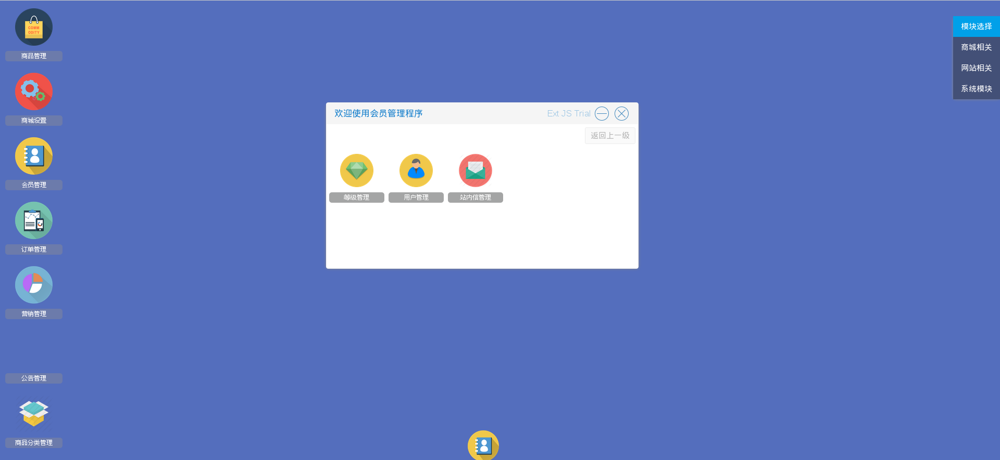

# 用户相关操作

* 商城管理员可以制定自己的会员系统
* 商城管理员可以对注册的用户信息进行修改（不建议，除非注册的用户有相关需求），锁定（用户违法了相关规定）
* 商城管理员可以向注册的用户发送一些消息，比如通知用户哪些活动要开始了或者快结束了等等

用户操作入口　进入系统后台后在桌面右上方模块选择栏选择商城相关，可以看到桌面上有一个会员管理图标，点击进入用户相关的操作

如图1

在弹出的窗口中

选择等级管理进入用户等级的相关操作

选择用户管理进入用户相关的操作

选择站内信管理进入消息相关的操作
