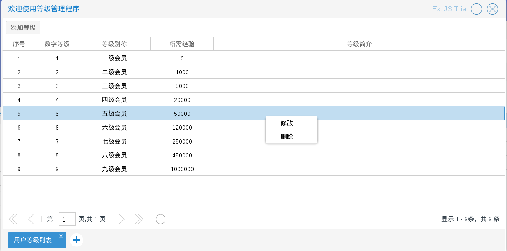
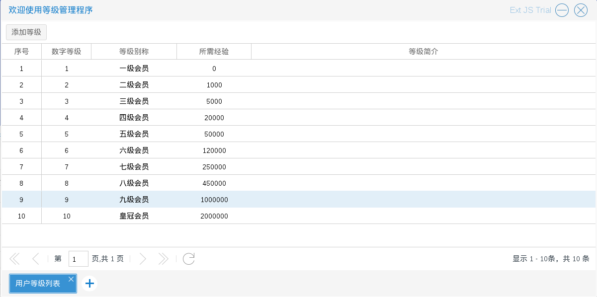
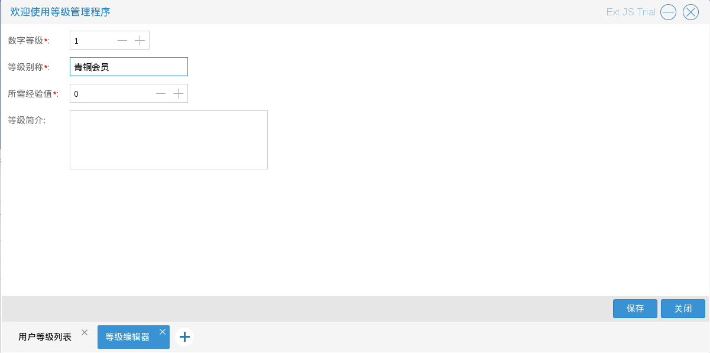
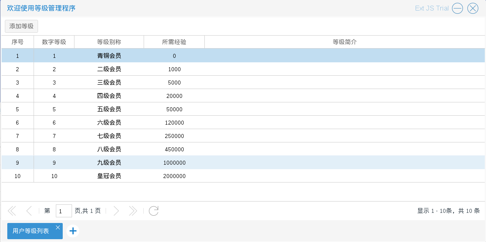

# 用户等级

商城使用者得到的初始化系统，有一套默认的会员等级系统：

分为１～９级，等级称号是一级会员－－九级会员

如图1.1.1

商城使用者可以将原有的等级系统删除，再自己重新设计一套会员等级系统（不建议），也可以在默认的系统之上添加，修改

* 添加会员等级　入口在图1.1.1中的添加等级按钮　如图1.1.2－1.1.3

* 修改会员等级　入口在图1.1.1中的右键弹出列表选择修改　如图1.1.4－1.1.6

* 删除会员等级　入口在图1.1.1中的右键弹出列表选择删除
