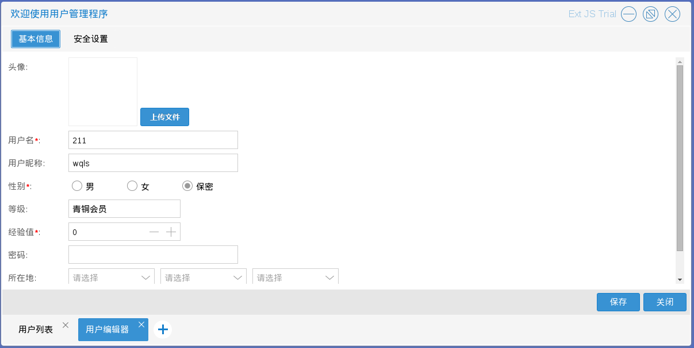
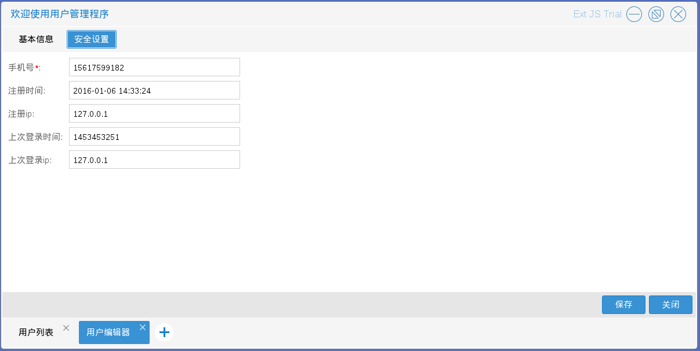
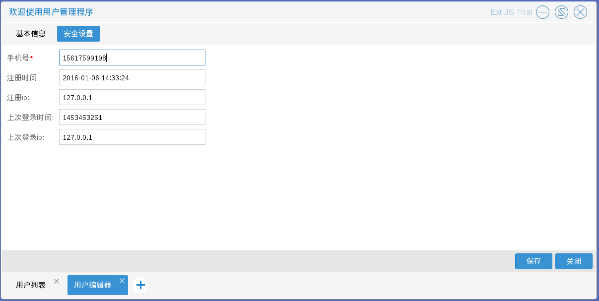
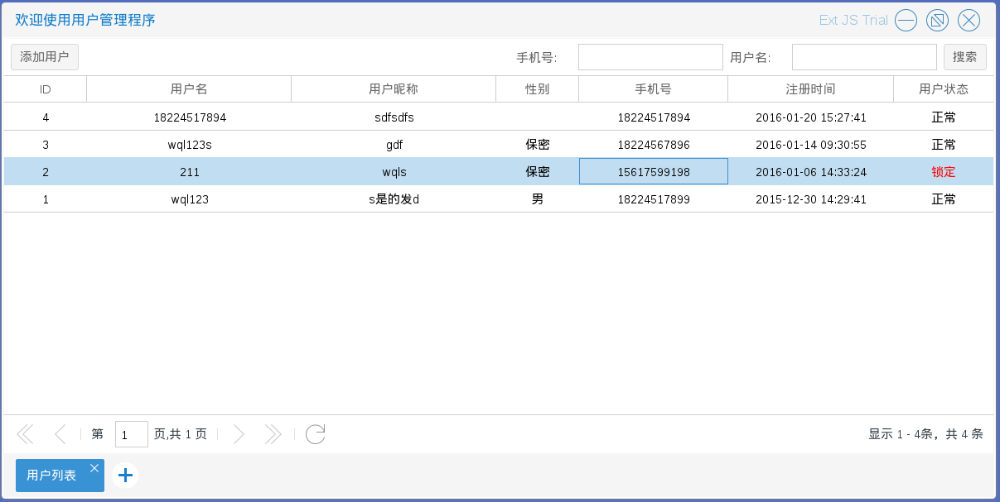

# 用户管理

商城管理员进入用户管理程序后，可以对注册用户的信息进行必要的修改（用户有相关诉求又无法通过前台进行修改的时候）、也可以对违反相关规定的用户进行锁定

如图1.2.1

* 修改用户信息　用户信息分为两部分：基本信息和安全设置　入口为图1.2.1中单击右键后出现的选择列表中的修改

例如：用户的手机掉了，需要换一个手机号，通过查询相关的信息核实的情况下，可以在后台进行修改
如图1.2.2－1.2.3

只需将用户信息中的安全设置里面手机号改为正确的即可　如图1.2.4

保存后，修改完成　如图1.2.5

* 锁定违法规定的用户，入口为图1.2.1中单击右键后出现的选择列表中的锁定

用户被锁定后将无法登录商城，如图1.2.6

* 添加用户（不建议使用）
