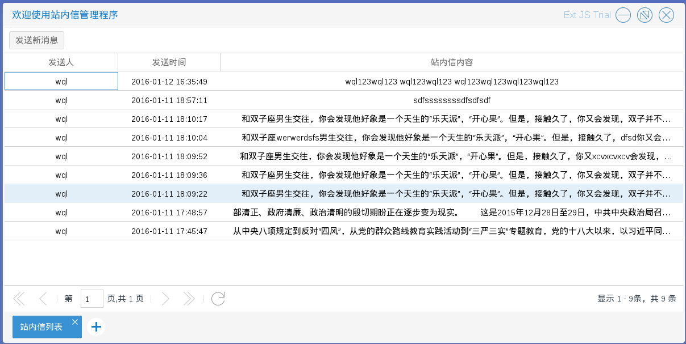
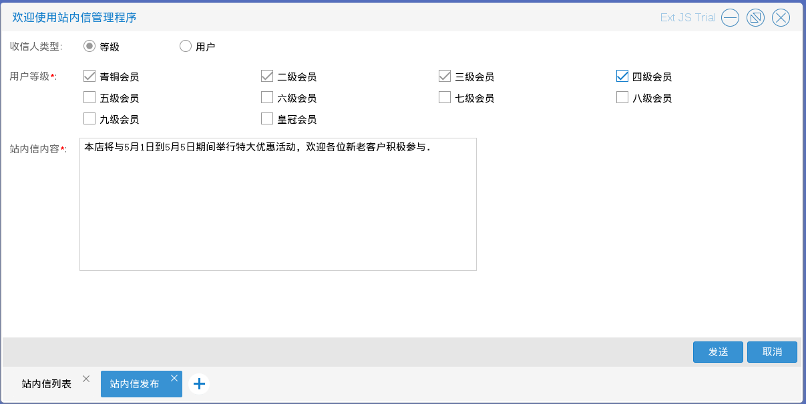
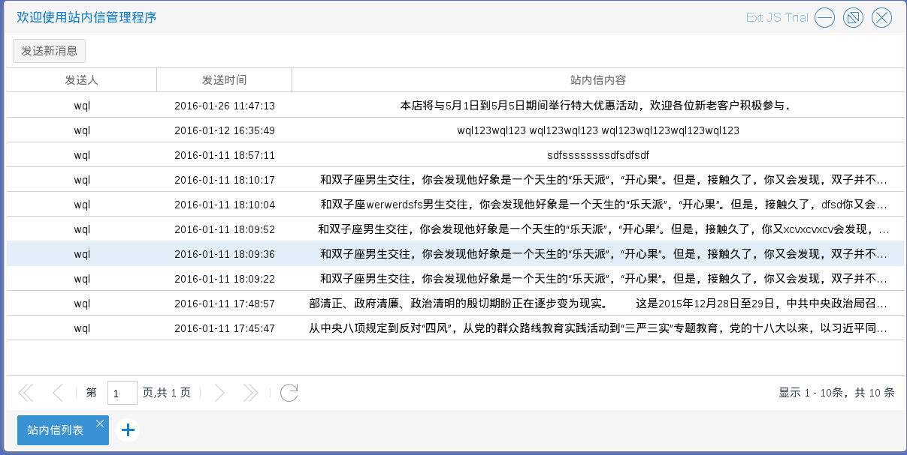
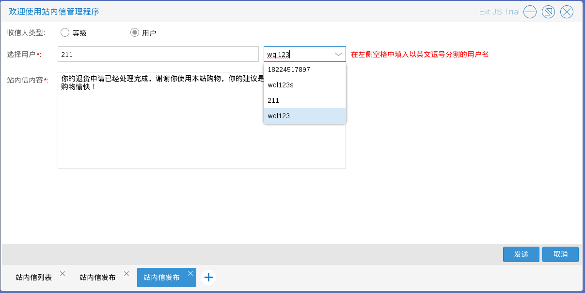
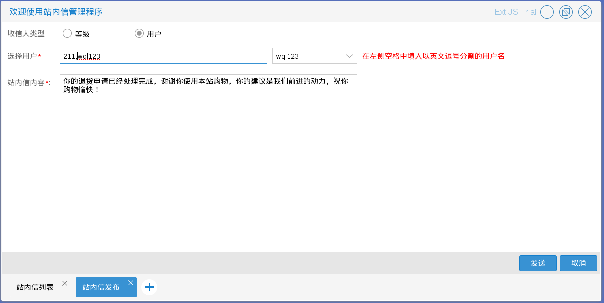
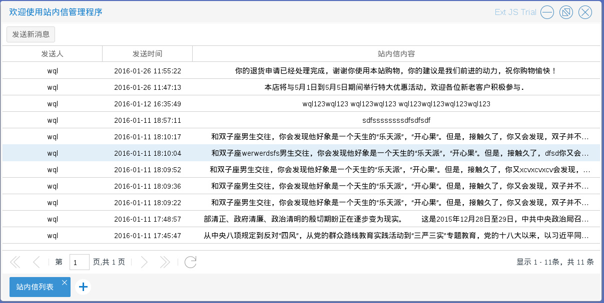

# 消息管理

商城管理员进入站内信管理程序后，可以向注册用户发送一些消息，包括推荐，提醒等等

发送消息有两种方式　入口在如图1.3.1中的发送新信息按钮

* 按等级发送，符合等级的都会收到发送的消息　如图1.3.2－1.3.3

* 按用户发送，指定的用户都会收到发送的消息，可以向单个用户发送消息也可想多个
用户发送消息（用户之间用英文逗号','隔开）　如图1.3.4－1.3.6

